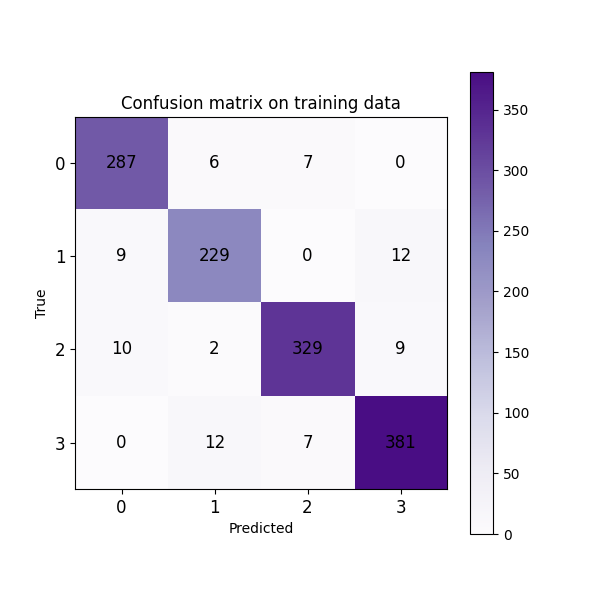
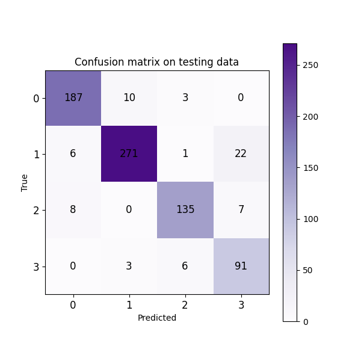
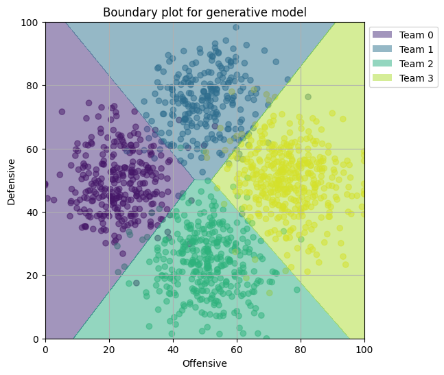
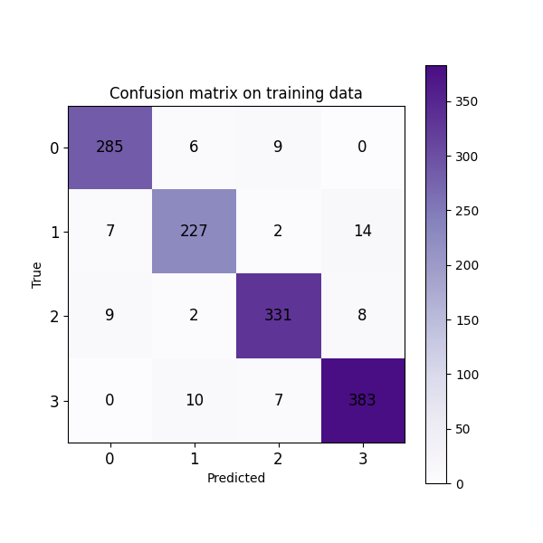
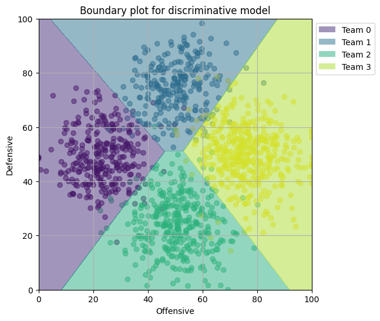
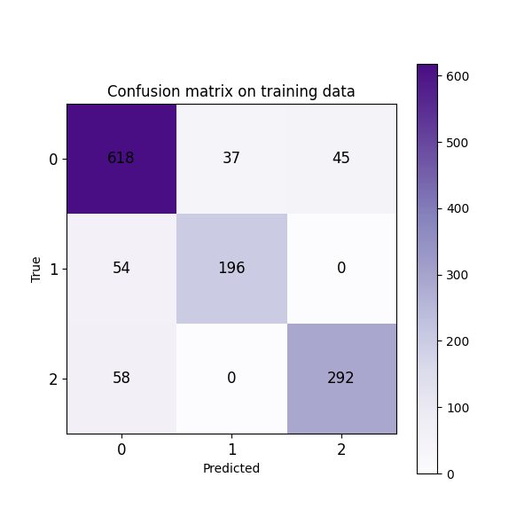
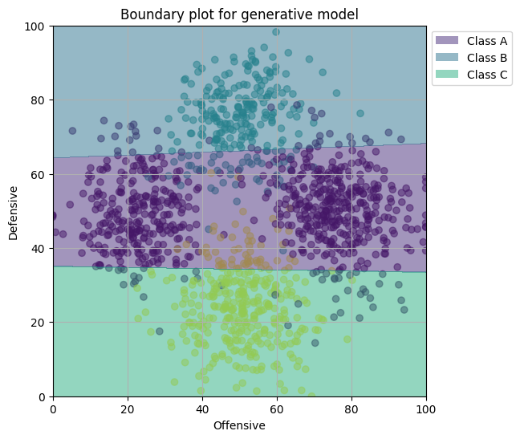
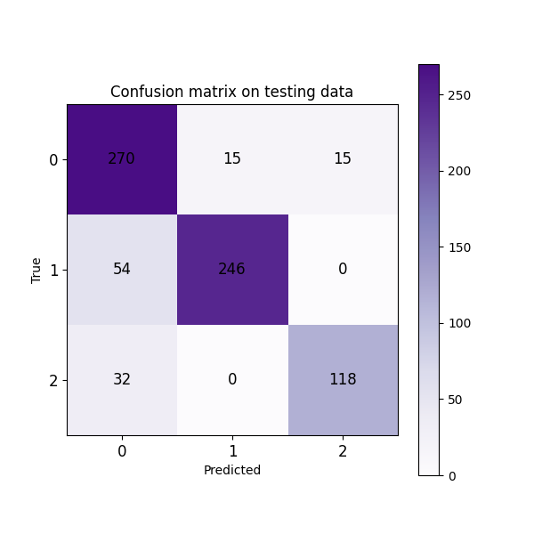
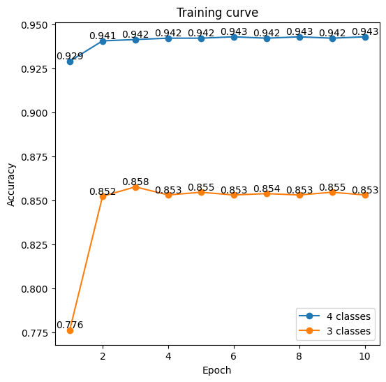

# HW2 REPORT

## 1. Results

### 1.1 Part 1: 4 Classes
#### 1.1.1 Generative Model

Prediction Accuracy on Training Data: 0.943
Prediction Accuracy on Testing Data: 0.912

<div style="display: flex;">
    
    
</div>
<p align="center">Confusion Matrix for Generative Model.</p>

<p align="center">
    
</p>
<p align="center">Confusion Matrix for Generative Model.</p>

#### 1.1.2 Discriminative Model

Prediction Accuracy on Training Data: 0.943
Prediction Accuracy on Testing Data: 0.909

<div style="display: flex;">
    
    
</div>
<p align="center">Confusion Matrix for Discriminative Model.</p>

<p align="center">
    
</p>


### 1.2 Part 2: 3 Classes
#### 1.2.1 Generative Model

Prediction Accuracy on Training Data: 0.851
Prediction Accuracy on Testing Data: 0.843

<div style="display: flex;">
    
    
</div>
<p align="center">Confusion Matrix for Generative Model.</p>

<p align="center">
    
</p>
<p align="center">Confusion Matrix for Generative Model.</p>

#### 1.2.2 Discriminative Model

Prediction Accuracy on Training Data: 0.853
Prediction Accuracy on Testing Data: 0.845

<div style="display: flex;">
    
    
</div>
<p align="center">Confusion Matrix for Discriminative Model.</p>

<p align="center">
    
</p>

## 2. Implementation
I implemented the generative model and the discriminative model in C++.

### 2.1 Generative Model
#### 2.1.1 Training
Following is the training function for the generative model.
```c++
void GenModel::Train(DataLoader* dl_train) {
    this->dl_train = dl_train;
    matrix_t mean = Mean(dl_train->x, dl_train->t);
    matrix_t cov = Cov(dl_train->x, dl_train->t, &mean);
    weights = new matrix_t(cov.inverse() * mean.transpose());
    vector_t priors = (*dl_train->priors).array().log();
    bias = new vector_t(n_classes);
    for (int i = 0; i < n_classes; i++)
        (*bias)(i) = -0.5 * mean.row(i) * cov.inverse() * mean.row(i).transpose() + priors(i);
}
```
1. First, I calculated the mean and covariance of the training data. Each class has its own mean. The covariance is the weighted average of the covariance of each class.
2. Then I calculated the weights and bias for the model using the formula:
```
w = cov^-1 * mean
b = -0.5 * mean * cov^-1 * mean + log(prior)
```
Where `prior` is the prior probability of each class.

#### 2.1.2 Testing
Following is the testing function for the generative model.
```c++
vector_t GenModel::GenPredict(DataLoader* dl_test) {
    this->dl_test = dl_test;
    matrix_t x = *dl_test->x;
    int n_samples = dl_test->n_samples;
    matrix_t y = x * (*weights) + (*bias).transpose().replicate(n_samples, 1);
    y = Softmax(&y);
    vector_t pred = Predict(&y);
    return pred;
}
```
1. I calculated the output of the model (before softmax) using the formula:
```
a = x * w + b
```
2. Then I applied the softmax function to the output to get the probabilities of each class.
3. Finally, I predicted the class with the highest probability.

### 2.2 Discriminative Model
#### 2.2.1 Training
Following is the training function for the discriminative model.
```c++
void DisModel::Train(DataLoader* dl_train) {
    this->dl_train = dl_train;
    matrix_t x = *dl_train->x;
    vector_t t = *dl_train->t;
    int n_samples = dl_train->n_samples;
    matrix_t one_hot = OneHot(&t);
    matrix_t design_x = DesignMatrix(&x);
    matrix_t weights = matrix_t::Zero(n_classes, n_features + 1);
    for (int i = 0; i < 10; i++) {
        matrix_t y = design_x * weights.transpose();
        matrix_t softmax_y = Softmax(&y);
        matrix_t error = softmax_y - one_hot;
        matrix_t grad = design_x.transpose() * error;
        for (int j = 0; j < n_classes; j++) {
            matrix_t diagnol_y = (softmax_y.col(j).array() * (1 - softmax_y.col(j).array())).matrix().asDiagonal();
            matrix_t hessian = design_x.transpose() * diagnol_y * design_x;
            weights.row(j) -= hessian.completeOrthogonalDecomposition().pseudoInverse() * grad.col(j);
        }
    }
    this->weights = new matrix_t(weights);
}
```
1. I created a one-hot matrix for the target values, where each row represents a sample and each column represents a class.
2. I created a design matrix by adding a column of ones to the feature matrix. That is, the first column of the design matrix is all ones and the second/third columns are the first/second features.
3. I **initialized the weights matrix to zeros**, since it's easier to train the model starting from weights close to zero.
4. I trained the model using the Newton-Raphson method. I iterated 10 times to update the weights. The update formula is:

$$
w_{new} = w_{old} - H^{-1} \nabla E(w)
$$
$$
E(w) = \phi^T (y - t)
$$
$$
H = \phi^T R \phi
$$

Where:
- $\phi$ is the design matrix same as in the generative model
- $R$ is the diagonal matrix of the softmax output with $R_{nn} = y_n(1 - y_n)$

Also, I used the pseudo-inverse of the Hessian matrix to update the weights to avoid singularities.

#### 2.2.2 Testing
Following is the testing function for the discriminative model.
```c++
vector_t DisModel::GenPredict(DataLoader* dl_test) {
    this->dl_test = dl_test;
    matrix_t x = *dl_test->x;
    vector_t t = *dl_test->t;
    int n_samples = dl_test->n_samples;
    matrix_t design_x = DesignMatrix(&x);
    matrix_t y = design_x * (*weights).transpose();
    matrix_t softmax_y = Softmax(&y);
    vector_t pred = Predict(&softmax_y);
    return pred;
}
```
1. I calculated the output of the model using the formula:
$$
a_k = w_k^T \phi(x)
\equiv
a = \Phi w^T
$$
2. Then I applied the softmax function and predicted the class with the highest probability, same as in the generative model.

### 2.3 Plotting Decision Boundary
I plotted the decision boundary for both models using the `matplotlib` library in Python. First, I generated the output of the model for a grid of points in C++ and saved it to a file. Then I read the file in Python and plotted the decision boundary using the `contourf` function. Also, I plotted the training and testing data points on the same plot using the `scatter` function.

## 3. Discussion
### 3.1 Differences between generative model and discriminative model
- When training the generative model, we get the weights by the mean, covariance, and prior probabilities of the classes in one step. While in the discriminative model, we randomly initialize the weights (zeros in my inplementation) and update them iteratively to minimize the loss.
- This makes the generative model more robust to noise in the data, since it models the distribution of the features. However, the discriminative model is more flexible and can model complex decision boundaries, but this is not obvious in this homework since the basis functions are linear.
- Another difference is that the discriminative model requires iterating multiple times to update the weights, while the generative model calculates the weights in one step. Following is the training curve for the discriminative model. It takes about 2 iterations to converge.

<p align="center">
    
</p>

### 3.2 Why the diciision boundary is linear
Since the prediction is based on the class with the highest probability, the decision boundary is the line where the probabilities of two classes are equal. This is a linear equation since the basis functions are linear in this homework.
Therefore, we can see that the decision boundary between the classes is linear in the plots.

### 3.3 Why the Hessian matrix would be singular
The Hessian matrix is singular when the design matrix or the diagonal matrix of the softmax output is singular. This can happen when the features are linearly dependent or when the softmax output is constant. In this homework, I used the pseudo-inverse of the Hessian matrix to avoid singularities. However, the Hessian matrix can still be singular if the features are highly correlated or if the softmax output is constant.

### 3.4 Why the accuracy is lower for 3 classes
In part 2, we turned the class 3 into class 0. For generative model, the distribution of class 0 is no longer the simple Gaussian distribution, but a mixture of two Gaussian distributions. Also the prior probabilities of the classes are different. The latter would make the model biased towards the class with higher prior probability. For the discriminative model, the model can't model the complex decision boundary between the classes, since the basis functions are linear. I think these are the reasons why the accuracy is lower for 3 classes.